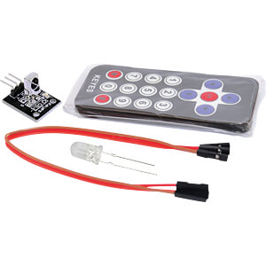

# IRRemoteESP32

Library for receiving and decoding IR signals using an ESP32.<BR>
It supports Arduino-ESP32 >= 3.02 based on ESP-IDF v5.1.4+!<BR>


## Installation

1. Download the library.
2. Unzip and place the `IRRemoteESP32` folder in your `Arduino/libraries` directory.
3. Restart the Arduino ID

## Usage

The library uses IR Remote for Arduino

Returned codes:

Button  -      Code:
0       -       0;
1       -       1;
2       -       2;
3       -       3;
4       -       4;
5       -       5;
6       -       6;
7       -       7;
8       -       8;
9       -       9;
\*      -       10;
\#      -       11;
OK      -       12;
UP      -       13;
RIGTH   -       14;
DOWN    -       15;
LEFT    -       16.

## Example

```cpp
#include <IRRemoteESP32.h>

IRRemoteESP32 irRemote;

void setup() {
    Serial.begin(115200);
    irRemote = IRRemoteESP32();
}

void loop() {
    int result = irRemote.checkRemote();
    if (result != -1) {
        Serial.println(result);
    }
    delay(100);
}

## Based
The library based on the code of
https://github.com/schreibfaul1/ESP32-IR-Remote-Cont

